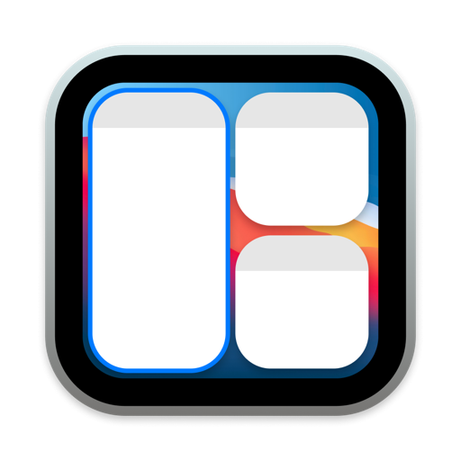

<div align="center">



# MCSC

### Mission Control Shortcuts — keyboard and trackpad window management for macOS

[](https://www.apple.com/macos/)
[](https://swift.org)
[](https://opensource.org/licenses/MIT)

A lightweight, event-driven menu bar utility that adds window-management
shortcuts and gestures to Mission Control.

[Features](#features) · [Installation](#installation) · [Usage](#usage) · [Documentation](#documentation)


</div>

---

MCSC is a small background app that brings fast window management to Mission
Control. It is built as a learning project to explore low-level macOS APIs,
event systems, and accessibility automation while staying tiny — near-zero idle
CPU and a memory footprint under 13 MB.

It is heavily inspired by the original [Mission Control Plus](https://www.folivora.ai/missionscontrol)
and by [Swish](https://highlyopinionated.co/swish/), whose trackpad gestures MCSC
tries to replicate.

> [!NOTE]
> Every shortcut and gesture is **scoped to Mission Control only**. It fires
> while Mission Control is open and stays silent on the desktop, in Launchpad,
> and in expanded Finder folder stacks.

## Features

| Feature | What it does |
| --- | --- |
| 🔍 **Type-to-Select** | Start typing any app name in Mission Control to instantly rank and highlight matching windows. `Tab` cycles, `Enter` activates. |
| 🖱️ **Hover Action Buttons** | Floating button on every window preview — Close, `Option` Minimize, `Command` Force Quit. |
| ⌨️ **Keyboard Shortcuts** | `Cmd+W` close · `Cmd+Q` force quit · `Cmd+M` minimize · `Cmd+H` hide · `Cmd+Space` recover stuck Mission Control. |
| ✋ **14 Trackpad Gestures** | Pinch in/out, 4-direction swipes, two-finger double-tap — each with a `Cmd` variant. Replicates [Swish](https://highlyopinionated.co/swish/). |
| 🪟 **Window Tiling & Tabs** | Fill screen, resize presets (+33% / −33% / 60% / 90%), fullscreen toggle, and tab close / reopen / new via swipes. |
| 💿 **Auto-Eject Volumes** | Close + eject mounted volumes (e.g. DMG installers) straight from Mission Control. |
| 🎯 **Cursor Feedback + Haptics** | Every action flashes a distinct SF Symbol at the cursor with paired haptic feedback. |
| 🐳 **Dock Gestures Outside MC** | The same shortcuts and gestures also work hovering Dock icons on the desktop, with App Exposé suppressed mid-gesture. |
| 🧭 **Dock-Aware Targeting** | Point at a window preview → window action; point at a Dock icon → app-level action. |
| 🛡️ **Strict Scoping** | Fires only inside Mission Control — silent on the desktop, Launchpad, and Finder stacks. |
| ⚡ **Zero-Footprint** | AppKit-only, event-driven (no polling): **~12.4 MB** memory, ~0% idle CPU. |
| ⚙️ **Fully Configurable** | Per-shortcut and per-gesture toggles in the menu bar / Settings, plus Launch at Login. |

> Deep dives for every feature live in the [Documentation](#documentation) section.

## Requirements

MCSC needs the **Accessibility** permission to inspect windows and intercept
global input. Grant it from:

```text
System Settings → Privacy & Security → Accessibility
```

Without it, the app runs but cannot act on windows. The first launch prompts
for the permission, and MCSC boots the moment it is granted.

## Installation

Clone the repository and build with Xcode:

```bash
git clone https://github.com/yourusername/MCSC.git
cd MCSC
open MCSC.xcodeproj
```

Build using the `MCSC` scheme, then run. To sign a distributed build, for
example with Sentinel:

```bash
sentinel sign --app MCSC.app --identity "Developer ID Application: Your Name (TeamID)"
codesign -dv --verbose=4 MCSC.app
```

## Usage

MCSC runs as a menu bar icon (no Dock presence). Use the menu to toggle
individual shortcuts and gestures on or off, enable launch at login, and quit.

Once Mission Control is open, point at a window preview or start typing to use any of the
actions below.

**Type-to-Select (Fuzzy Finder)**

| Input | Action |
| --- | --- |
| Type letters / numbers (`e.g. ghostty, code`) | Fuzzy-matches window owner names, draws native highlight on best match, displays Dock-style query pill |
| `Enter` / `Return` | Activates and raises the selected window, dismissing Mission Control |
| `Tab` / `Down Arrow` | Cycles forward through matching windows |
| `Up Arrow` | Cycles backward through matching windows |
| `Escape` / `Backspace` | Clears query / deletes last character |

**Keyboard shortcuts**

| Shortcut | Action |
| --- | --- |
| `Cmd + W` | Close window / active tab (ejectable Finder volume → close + eject) |
| `Cmd + Q` | Force quit app (ejectable Finder volume window → close + eject) |
| `Cmd + M` | Minimize window |
| `Cmd + H` | Hide app |
| `Cmd + Space` | Recover a stuck Mission Control / Spotlight state |

**Trackpad gestures**

| Gesture | Action | `Cmd` + gesture |
| --- | --- | --- |
| Pinch in | Close window / quit app (ejectable Finder volume → eject) | Force quit app (ejectable Finder volume → eject) |
| Swipe left | Close active tab (ejectable Finder volume → eject) | Close all tabs |
| Swipe right | Reopen closed tab | New window |
| Swipe up | Minimize window | Hide app |
| Swipe down | Fill screen | Make larger (+33%) |
| Two-finger double tap | Reasonable size (60%) | Almost maximize (90%) |

> **Make Smaller (−33%)** is available as a selectable gesture action in Settings
> (bind it to any gesture slot). It shrinks the window from its center by ~33%,
> clamped to a 200×100 pt minimum, the inverse of Make Larger so the pair
> round-trips back to the original size.

Each gesture fires **once per finger lift**, so holding your fingers down and
repeating the motion will not re-trigger it. For the full mapping, hover
buttons, and how recognition works, see [SHORTCUTS.md](./docs/SHORTCUTS.md) and
[GESTURES.md](./docs/GESTURES.md).

## Documentation

These guides go deeper than the summaries above:

- [SHORTCUTS.md](./docs/SHORTCUTS.md) — every keyboard shortcut, type-to-select fuzzy finding, and hover buttons.
- [GESTURES.md](./docs/GESTURES.md) — every trackpad gesture and how recognition works.
- [MISSION_CONTROL.md](./docs/MISSION_CONTROL.md) — how MCSC detects and scopes to Mission Control.
- [SYMBOLS.md](./docs/SYMBOLS.md) — the SF Symbol map behind the feedback overlays.
- [PERFORMANCE.md](./docs/PERFORMANCE.md) — memory and CPU budget and how it stays light.
- [ARCHITECTURE.md](./docs/ARCHITECTURE.md) — the MVVM design, event tap pipelines, and low-level choices.

## Credits & Acknowledgements

- **Inspirations:** MCSC is inspired by [Mission Control Plus](https://www.folivora.ai/missionscontrol) and by [Swish](https://highlyopinionated.co/swish/). Its trackpad gestures replicate the interaction model that Swish popularized.
- **OpenMissionControl:** Special thanks to the [OpenMissionControl](https://github.com/nohackjustnoobb/OpenMissionControl) repository and specifically [PR #3 (changes)](https://github.com/nohackjustnoobb/OpenMissionControl/pull/3/changes) by `nohackjustnoobb` and contributors. Studying their implementation and PR changes unlocked low-level Mission Control window management and keyboard interaction capabilities after being stuck on them for a long time, greatly aiding my learning of private Exposé SPIs (`CoreDockSendNotification`) and Quartz event routing in Mission Control.

> [!NOTE]
> MCSC approximates Swish's gestures but is not a full replacement. Reaching parity with
> Swish's feature set according to my needs only works in mission control right now.

> [!NOTE]
> This is an educational project. It was built with the help of AI coding
> tools, and is not presented as fully handcrafted from scratch. If you want a
> polished, production-grade experience, support the original developers.

Licensed under the MIT License.
