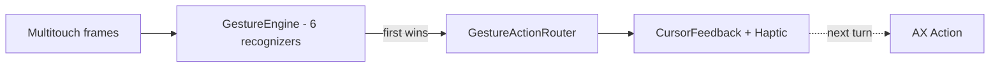
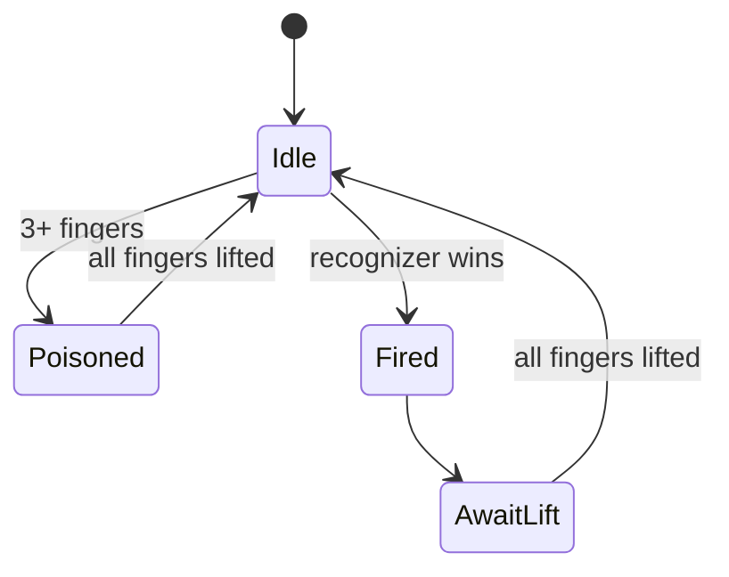

# Trackpad gestures

This document lists every trackpad gesture MCSC recognizes inside Mission
Control and the action each one triggers. For keyboard shortcuts and the hover
buttons, see [SHORTCUTS.md](./SHORTCUTS.md). For the symbol language used in
feedback overlays, see [SYMBOLS.md](./SYMBOLS.md).

Like the shortcuts, every gesture is **scoped to Mission Control only** and
stays silent on the desktop, in Launchpad, and in Finder folder stacks. The
detection heuristic is described in [ARCHITECTURE.md](./ARCHITECTURE.md).

---

## How the gestures work

Raw multitouch frames arrive from `MultitouchService` and are handed to a
`GestureEngine`, which runs a small set of recognizers in registration order.
The first recognizer to report a completed gesture wins, and all recognizers
reset.

Two rules keep gestures from firing by accident:

- **One gesture per finger lift.** After a gesture fires, further frames are
  ignored until every finger leaves the trackpad. Holding your fingers down and
  repeating the motion will not re-trigger it.
- **Three-finger poison.** If three or more fingers touch at any point, the
  current cycle is discarded and nothing fires until all fingers lift. This
  prevents MCSC from reacting to the system's own three-finger Mission Control
  invocation.

In addition, MCSC applies a 0.5-second cooldown immediately after Mission
Control activates, so the swipe that opened Mission Control does not
immediately trigger an action.

When a gesture fires, MCSC shows the cursor feedback symbol and plays a haptic
at gesture onset, in parallel with the slower Accessibility action, which runs
one run-loop turn later.

#### Visual — Pipeline & Guard Rails

| Guard | Location |
|-------|----------|
| `awaitingLift` — one per finger lift | `GestureRecognizer.swift:37` |
| `poisoned` — 3+ fingers discards cycle | `GestureRecognizer.swift:58` |
| `isCoolingDown` — 0.5 s after MC activation | `ShortcutViewModel.swift:60` |
| `isMissionControlActive` gate | `ShortcutViewModel.swift:169` |

---

## Gesture reference

Point at a window preview to act on that window, or point at a Dock item (app
icon) to act on the whole app. Holding `Command` while performing a gesture
switches to the "command" variant listed in the right column.

| Gesture | Action | `Cmd` + gesture |
| --- | --- | --- |
| Pinch in | Close window / quit app | Force quit app |
| Pinch out | Toggle fullscreen | New window (`Cmd + N`) |
| Two-finger swipe left | Close active tab | Close all tabs (`Cmd + Shift + W`) |
| Two-finger swipe right | Reopen closed tab | New tab (`Cmd + T`) / New window on Dock |
| Two-finger swipe up | Minimize window | Hide application |
| Two-finger swipe down | Fill screen | Make larger (+33%) |
| Two-finger double tap | Reasonable size (60%) | Almost maximize (90%) |

> [!NOTE]
> The swipe-down pair looks similar but is not identical. Without `Command` it
> expands the window to **fill the screen**; with `Command` it grows the window
> by **33%** from its center. Both show the maximize symbol at the cursor.

### Target resolution

Each gesture resolves what is under the cursor at the moment it fires:

- **Window target** — the cursor is over a window preview, so the action runs on
  that window (for example, close, minimize, resize, or hide its app).
- **Dock target** — the cursor is over an app icon in the Dock strip, so the
  action runs on the whole app (for example, close all windows or force quit).
- **No target** — neither a window nor a Dock item is under the cursor, so the
  gesture is ignored.

Directional swipes that have no meaningful app-level behavior (such as fill
screen and resize) only act on a window target and do nothing over the Dock.

#### Visual — Target Matrix

| Gesture | Window | Dock | Empty |
|---------|:------:|:----:|:-----:|
| Pinch in / Swipe left/up | ✅ | ✅ | ❌ |
| Pinch out | ✅ | ❌ | ❌ |
| Cmd + Pinch out | ✅ | ✅ | ❌ |
| Swipe right (reopen) | ✅ | ✅ | ❌ |
| Cmd + Swipe right | ✅ (new tab) | ✅ (new window) | ❌ |
| Swipe down / Double tap | ✅ | ❌ | ❌ |

> Details: `GestureActionRouter.swift:24-171` — `swipeDown`/`doubleTap` return `.none` for Dock.

### Mounted volume auto-eject (pinch-in / swipe-left on ejectable Finder volumes)

The same volume auto-eject described in [SHORTCUTS.md](./SHORTCUTS.md) also applies to gestures.
When the cursor is over a **Finder window showing an ejectable/removable volume** and
`Auto-Eject Mounted Volumes` is enabled, these gestures eject instead of their normal action:

| Gesture | Normal action | Eject action on Finder volume window |
|---|---|---|
| Pinch in | Close window / quit app (`.close`) | Close Finder window + eject volume (`.eject` / `eject.circle.fill`) |
| `Cmd` + pinch in | Force quit app (`.quit`) | Close Finder window + eject volume (`.eject`) |
| Two-finger swipe left | Close active tab (`.closeTab`) | Close Finder window + eject volume (`.eject`) |

- **Detection/routing:** `GestureActionRouter.routeGesture(... volumeService:isAutoEjectEnabled:)` checks
  `isAutoEjectEnabled && volumeService.ejectableVolumePath(forDocumentPath:windowTitle:) != nil`
  for the `.window` target before falling through to the standard close/quit/closeTab path.
  Finder-only (`bundleIdentifier == "com.apple.finder"`); Dock targets never eject.
- **Feedback/haptics:** `.eject` uses `eject.circle.fill` with White + systemRed palette and the
  hover-style scale (1.08× / 0.15 s ease-out) animation — same as `CursorFeedbackOverlay`'s close/quit
  flash. Haptic preserves the original gesture's (`pinchIn` or `swipeLeft`).
- **Ejection:** `EjectVolumeAction` → `MountedVolumeService.ejectVolume(at:)` (`NSWorkspace.unmountAndEjectDevice`).
  See [SHORTCUTS.md](./SHORTCUTS.md) for the full detection and toggle details.

| Recognizer | File |
|------------|------|
| `PinchInRecognizer` | `PinchInRecognizer.swift` |
| `PinchOutRecognizer` | `PinchOutRecognizer.swift` |
| `SwipeRecognizer` (up+down) | `SwipeRecognizer.swift` |
| `TwoFingerSwipeLeft/Right` | `TwoFingerSwipe*.swift` |
| `TwoFingerDoubleTap` | `TwoFingerDoubleTapRecognizer.swift` |

Registration order: `DoubleTap → PinchIn → PinchOut → SwipeLeft → SwipeRight → Swipe` (`ShortcutViewModel.swift:134`).

---

## Relationship to hover buttons

Gestures and the hover button ([SHORTCUTS.md](./SHORTCUTS.md)) coexist inside
Mission Control. The hover button is a click target you drive with the mouse,
while gestures are driven by the trackpad. Both share the same underlying
Accessibility actions and the same feedback-symbol system described in
[SYMBOLS.md](./SYMBOLS.md).

---

## Source references

- Gesture recognition and dispatch:
  `../MCSC/Models/GestureRecognizer.swift` (`GestureEngine`, `GestureResult`)
- Individual recognizers: `../MCSC/Models/PinchInRecognizer.swift`, `../MCSC/Models/PinchOutRecognizer.swift`,
  `../MCSC/Models/SwipeRecognizer.swift`,
  `../MCSC/Models/TwoFingerSwipeLeftRecognizer.swift`,
  `../MCSC/Models/TwoFingerSwipeRightRecognizer.swift`,
  `../MCSC/Models/TwoFingerDoubleTapRecognizer.swift`
- Raw multitouch input: `../MCSC/Services/MultitouchService.swift`,
  `../MCSC/Services/MultitouchBridge.swift`
- Gesture-to-action mapping and target resolution:
  `../MCSC/ViewModels/ShortcutViewModel.swift` + `../MCSC/ViewModels/Routing/GestureActionRouter.swift` (eject branch + `volumeService`)
- Action implementations: `../MCSC/Models/ShortcutActions.swift` + `../MCSC/Models/Actions/VolumeActions.swift` (`EjectVolumeAction`)
- Mounted volume detection/ejection: `../MCSC/Services/Volume/MountedVolumeService.swift`
- Haptics: `../MCSC/Services/HapticService.swift` (`pinchOut` distinct from `pinchIn`: `alignment → levelChange` expand feel vs `levelChange → levelChange`)
- Fullscreen: `../MCSC/Models/Actions/WindowActions.swift` (`ToggleFullscreenAction` via `kAXZoomButtonAttribute` + `CoreDockSendNotification("com.apple.expose.awake")`) and `../MCSC/Models/Actions/MissionControlWindowActions.swift` (`performFullscreen` — same Dock SPI, for Mission Control window dict path)
- Tab/Window creation: `../MCSC/Models/Actions/TabActions.swift` (`NewTabAction` `Cmd+T`, `NewWindowAction` `Cmd+N`)
