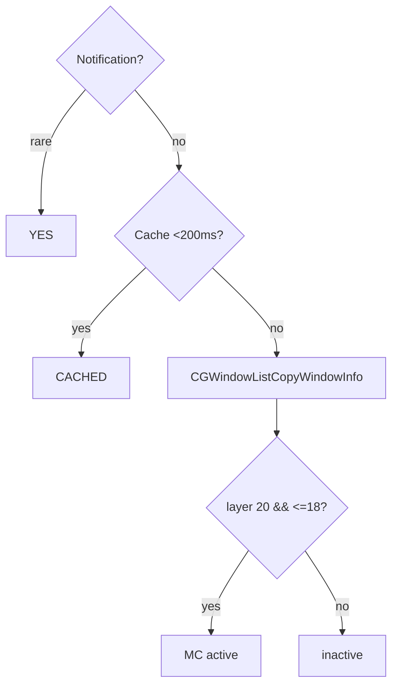

# Mission Control scoping

Every shortcut, gesture, and hover button in MCSC is **scoped to Mission
Control only**. This document explains how the app decides that Mission Control
is active, why the other full-screen layers are excluded, and how it recovers
when macOS gets stuck. The keyboard and gesture behaviors that depend on this
detection live in [SHORTCUTS.md](./SHORTCUTS.md) and
[GESTURES.md](./GESTURES.md).

---

## Why scoping matters

Mission Control, Launchpad, and expanded Finder folder stacks all draw
full-screen overlays. They look similar, but only Mission Control should receive
MCSC's window actions. Firing a close or minimize while Launchpad is open, or
while a Finder folder stack is expanded in the Dock, would act on the wrong
surface. Scoping keeps the app predictable.

---

## How detection works

`MissionControlService` uses a two-pronged approach:

- **Distributed Dock notifications.** It observes names such as
  `com.apple.MissionControl.start` and `com.apple.expose.start`. On current
  macOS versions these notifications often do not reach a standalone process, so
  this is only a fast path, not the source of truth.
- **Window-list heuristic.** It calls `CGWindowListCopyWindowInfo` and inspects
  the layers of empty-named Dock windows. Mission Control exposes a full-screen
  Dock overlay at **layer 20** together with the Dock bar at **layer 18 or
  below**. The combination of those two signatures is what identifies Mission
  Control.

The result is cached for **200 ms** so that gesture frames never trigger a fresh
window-list scan on every trackpad event.

> [!NOTE]
> The heuristic intentionally excludes two look-alikes. **Launchpad** draws its
> overlay at layers 27 to 29, which is above the Mission Control signature. An
> expanded **Finder folder stack** shows only the overlay window and lacks the
> Dock bar, so it fails the second condition. Both are correctly ignored.

---

## Activation cooldown

When Mission Control activates, MCSC starts a 0.5-second cooldown. This prevents
the three-finger swipe that opened Mission Control from immediately triggering a
gesture. After the cooldown, gestures and shortcuts respond normally.

---

## Recovery sequence

Mission Control can swallow `Cmd + Space`, leaving macOS in a stuck state. While
Mission Control is open, MCSC repurposes `Cmd + Space` to run a recovery
sequence:

1. It posts `Escape` (key code 53) to dismiss the current overlay.
2. After 0.2 seconds it posts `Cmd + Space` (key code 49) to reopen the correct
   surface.

MCSC sets an `isSimulating` flag around the sequence so it does not react to its
own injected events.

---

## Source references

- Detection heuristic and caching: `../MCSC/Services/MissionControlService.swift`
- Cooldown hook: `../MCSC/ViewModels/ShortcutViewModel.swift` (`onActivated`)
- Scoped delivery of gestures: `../MCSC/Services/MultitouchService.swift`
- Scoped delivery of shortcuts: `../MCSC/Services/EventTapService.swift`
- Hover tracking gated on activity: `../MCSC/Services/MissionControlHoverService.swift`

#### Visual — Detection Flow

| Surface | Layers | Result |
|---------|--------|--------|
| Mission Control | 20 + ≤18 | ✅ active |
| Launchpad | 27-29 | ❌ |
| Finder stack | only overlay | ❌ |

