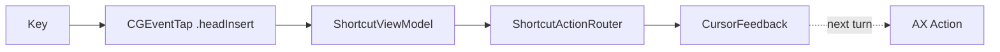
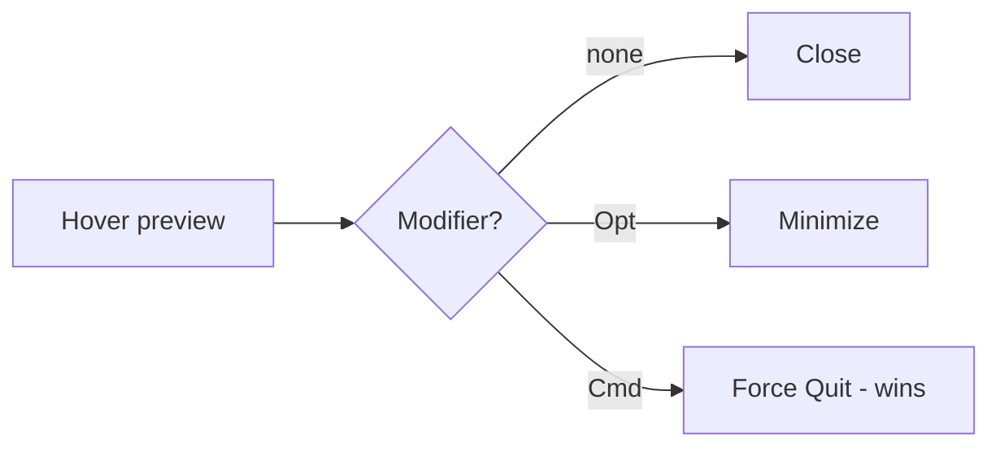

# Keyboard shortcuts & hover buttons

This document lists every keyboard-driven action MCSC provides and the
interactive hover buttons that appear inside Mission Control. For trackpad
gestures, see [GESTURES.md](./GESTURES.md). For the symbol language used in
feedback overlays, see [SYMBOLS.md](./SYMBOLS.md).

All shortcuts and hover buttons below are **scoped to Mission Control only**.
They fire while Mission Control is open and stay silent on the normal desktop,
in Launchpad, and in expanded Finder folder stacks. Read
[ARCHITECTURE.md](./ARCHITECTURE.md) for the detection heuristic.

---

## How the shortcuts work

MCSC intercepts key presses with a low-level `CGEventTap` placed at
`.headInsertEventTap`, so it sees each event before the frontmost app does. The
`EventTapService` forwards raw key codes and modifier flags to
`ShortcutViewModel`, which decides whether the combination matches a known
shortcut.

A shortcut matches only when **Command is held and no other modifier is
pressed**. Holding Shift, Control, or Option alongside Command disables the
keyboard shortcut path (those modifiers are reserved for gestures and the hover
button). Every shortcut also requires Mission Control to be active; otherwise
the event passes through untouched.

When a shortcut fires, MCSC shows cursor feedback first, then runs the blocking
Accessibility action one run-loop turn later. This ordering lets the symbol
render at the moment you press the key, instead of after the window has already
closed.

---

## Global keyboard shortcuts

These shortcuts work anywhere a window or app is targeted inside Mission Control.
Point at a window preview to act on that window, or point at a Dock item (app
icon) to act on the whole app.

| Shortcut | Window target | Dock (app) target |
| --- | --- | --- |
| `Cmd + W` | Close the window | Close the active tab in the app |
| `Cmd + Q` | Force quit the app owning the window | Force quit the app |
| `Cmd + M` | Minimize the window | Minimize all windows of the app |
| `Cmd + H` | Hide the app owning the window | Hide the app |
| `Cmd + Space` | Recover the Mission Control / Spotlight state (see below) | Same |

> [!NOTE]
> `Cmd + Q` and the Dock-target actions perform a **force** termination. They
> skip the normal quit handshake, so unsaved work in the targeted app is lost.

### Mounted volume auto-eject (`Cmd + W` / `Cmd + Q` on ejectable Finder volumes)

When the cursor targets a **Finder window that shows an ejectable/removable volume**
(e.g. a mounted DMG installer under `/Volumes`) in Mission Control, `Cmd + W` and
`Cmd + Q` automatically **close the Finder window and eject the volume** instead of
their normal close/quit action. This is intended for quickly dismissing installer
disks.

- **Detection:** via `MountedVolumeService.ejectableVolumePath(forDocumentPath:windowTitle:)` —
  reads `kAXDocumentAttribute` (file URL or `/Volumes/...` path) and `kAXTitleAttribute`
  from the window (`AccessibilityService.getDocumentPath` / `getWindowTitle`), then
  matches against `FileManager.mountedVolumeURLs` filtered by `volumeIsEjectable` /
  `volumeIsRemovable`. Finder-only (`bundleIdentifier == "com.apple.finder"`).
- **Action:** `EjectVolumeAction` presses the window's `kAXCloseButton` (best-effort)
  then calls `MountedVolumeService.ejectVolume(at:)` which runs `NSWorkspace.shared.unmountAndEjectDevice(at:)` off the main queue.
- **Feedback:** flashes `eject.circle.fill` at the cursor — White + systemRed palette
  (`[.white, .systemRed]`) with the same hover-style scale (1.08× over 0.15 s ease-out)
  and alpha animation used for close/quit (`CursorFeedbackOverlay.swift:197`).
- **Toggle:** menu bar **Auto-Eject Mounted Volumes** (`ShortcutConfiguration.isAutoEjectEnabled`, default `true`)
  — when disabled, `Cmd+W`/`Cmd+Q` fall through to their normal `.close`/`.quit` paths.
  The same eject check also applies to pinch-in / swipe-left gestures (see [GESTURES.md](./GESTURES.md)).
- **Scopes:** window targets only; Dock-target `Cmd+W`/`Cmd+Q` and non-Finder windows are unaffected.

### Mission Control recovery (`Cmd + Space`)

While Mission Control is open, pressing `Cmd + Space` does not open Spotlight.
Instead MCSC replays a recovery sequence so macOS leaves the stuck Mission
Control state:

1. It posts `Escape` (key code 53) to dismiss the current overlay.
2. After 0.2 seconds it posts `Cmd + Space` (key code 49) to reopen the correct
   surface.

MCSC ignores its own injected `Cmd + Space` events to avoid a feedback loop
(`MissionControlService.isSimulating` guards this).

---

## Mission Control hover action buttons

While Mission Control is open, MCSC renders a floating, clickable button at the
top-left vertex of every window preview. The button's action changes based on
the modifier you hold, and the SF Symbol animates to match. This is the same
overlay family described in [SYMBOLS.md](./SYMBOLS.md) under the hover-button
system (`PreviewCloseButtonOverlay`).

| Held modifier | Button action | SF Symbol | What happens on click |
| --- | --- | --- | --- |
| *(none)* | Close | `xmark.circle.fill` | Presses the window's native close button via Accessibility |
| `Option` | Minimize | `minus.circle.fill` | Presses the window's native minimize button |
| `Command` | Force quit | `xmark.circle.fill` | Force terminates the owning app |

> [!IMPORTANT]
> When both `Command` and `Option` are held, **Command wins** and the button
> becomes a force-quit. This precedence is enforced in
> `MissionControlHoverService.currentOverlayMode`.

The button appears only while the cursor is over a window preview and hides when
you move off it. Clicking the button swallows the mouse event so Mission Control
does not dismiss prematurely, plays a haptic, and runs the selected action.

---

## Source references

- Key handling and shortcut-to-action mapping:
  `../MCSC/ViewModels/ShortcutViewModel.swift` + `../MCSC/ViewModels/Routing/ShortcutActionRouter.swift` (eject branch + `volumeService`)
- Window- and app-level action implementations:
  `../MCSC/Models/ShortcutActions.swift` + `../MCSC/Models/Actions/VolumeActions.swift` (`EjectVolumeAction`)
- Mounted volume detection/ejection: `../MCSC/Services/Volume/MountedVolumeService.swift` (`MountedVolumeService`, `NSWorkspace.unmountAndEjectDevice`)
- Accessibility document/title helpers: `../MCSC/Services/Accessibility/AccessibilityService.swift` (`getDocumentPath`, `getWindowTitle`)
- Menu bar toggle: `../MCSC/App/AppDelegate.swift` (`Auto-Eject Mounted Volumes` → `ShortcutConfiguration.isAutoEjectEnabled`)
- Hover overlay, modifier precedence, and click handling:
  `../MCSC/Services/MissionControlHoverService.swift`
- Low-level key interception: `../MCSC/Services/EventTapService.swift`
- Mission Control detection and `Cmd + Space` recovery:
  `../MCSC/Services/MissionControlService.swift`
- Feedback symbols shown at the cursor: `../MCSC/Views/CursorFeedbackOverlay.swift`
- Hover button rendering: `../MCSC/Views/PreviewCloseButtonOverlay.swift`

#### Visual — Shortcut & Hover

